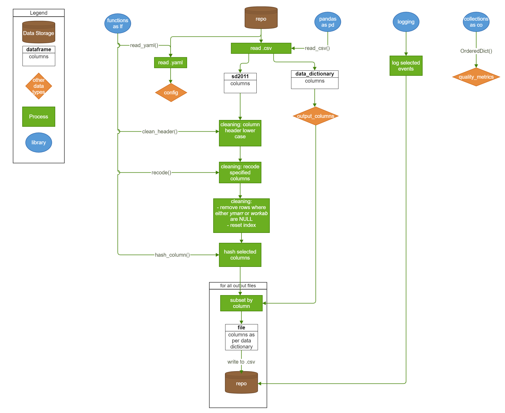

# ukhsa
-------
- demo pipeline for UKHSA job advert *UKHSA01111*

- processes custom version of the **sd2011** synthetic dataset into 2 derivatives:
- attributes (no disclosive columns)
- identifiers (disclosive)

# input data
- **source**: [SD2011 project](https://rdrr.io/cran/synthpop/man/SD2011.html)
- I added random numbers of NULL values and an ID column for added realism
- cf. the data dictionary in *inputs/data_dictionary.csv*

# flowchart
-----------

# desk instructions
-------------------
- find file *inputs/config.yml*
- update parameters as required
- in particular review:
- which columns to write to which outputs
- which column to hash
- review the output-column mapping in *inputs/data_dictionary.csv*
- run script *pipeline.py*
- review dictionary *quality_metrics* in memory
- review the engineering log in *sd2011.log*
